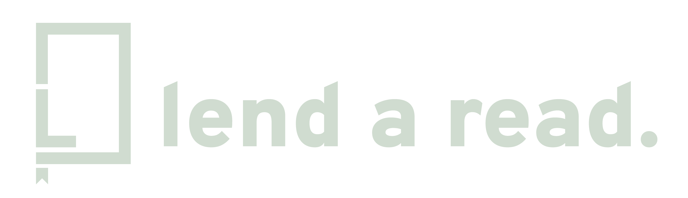

# Lend a Read
## Idea
The goal of the web application is to create a community of readers, where all of them can upload their books and request loans from each other. The aim is to allow readers to access books that would not normally be easily accessible.

For example, let's imagine the user Marco, who enjoys reading philosophy in multiple languages. Thanks to other readers with German heritage (for example), he can borrow a philosophy book from a German author that he could not have read by going to a library in Argentina.

## Users
**User with lender and borrower permissionsr:**
* Email: lender@lendaread.com.ar
* Password: PAW-2023a-03

**User with borrower permission:**
* Email: borrower@lendaread.com.ar
* Password: PAW-2023a-03
