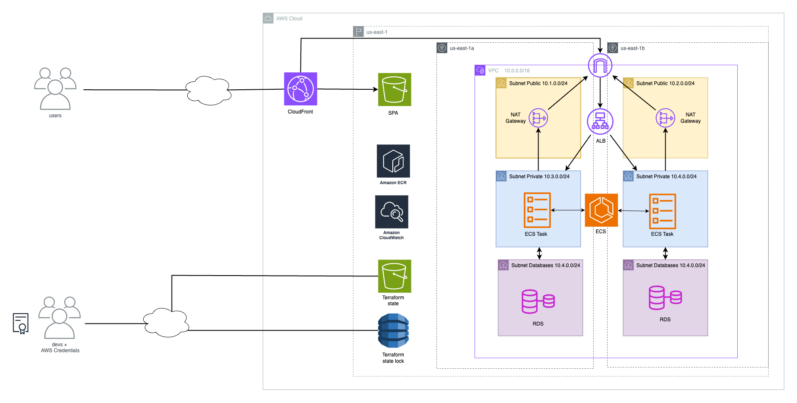

# LendARead AWS

This project is a continuation of https://github.com/Marco444/LendARead2 with the goal of providing a way to deploy the full stack web application. This project includes a modified version of the original repository as lambdas were added to manage mailing and for storing static files on a S3.

## LendARead's Goal


The goal of the web application is to create a community of readers, where all of them can upload their books and request loans from each other. The aim is to allow readers to access books that would not normally be easily accessible.

For example, let's imagine the user Marco, who enjoys reading philosophy in multiple languages. Thanks to other readers with German heritage (for example), he can borrow a philosophy book from a German author that he could not have read by going to a library in Argentina.

# Architecture Diagram



## Terraform Prerequisites

`docker` and `npm` are necessary for building the backend and the spa respectively. We reccomend using node version manager `nvm` and node version should be at least v19, we used `v20.13.1`

## Terraform Build

First go to the terraform folder
```bash
cd terraform/init
```

Now we need to create the S3 bucket and a DynamoDB to hold the terraform state lock. 

```bash
 terraform init
```

Then, apply the changes (make sure to set the AWS credentials beforehand). Also sample.tfvars holds the sample variables needed (this would change for dev/prod). We then run 

```bash
terraform apply -auto-approve -var-file=sample.tfvars
```

After running the command you will see the variable`s3_bucket` that is needed for later.


Next, go to the main architecture folder. Here is the architecture in itself, it will use `s3_bucket` to store its state, thus it needs to be built in a two-step fashion.

```bash
cd ../main
```

Now, you need to modify the `backend.tf` file with the values from the last apply, paste them verbatim. This tells Terraform where to store its state.

Let's init the configuration in the main folder:

```bash
terraform init
```

Note, if running the commands from ARM architecture (e.g. apple silicon) the variable `ecs_task_cpu_architecture` in the  `main/sample.tfvars` needs to be changed to `ARM64` or `X86_64` if running on any other architecture. Similarly, `docker` has to be installed in the system.

Similarly, the name of the bucket for the SPA should be unique, chances are that in the current tfvars is not

Finally, let's deploy the architecture to AWS 🚀

```bash
terraform apply -auto-approve -var-file=sample.tfvars
```
Note, if running the commands from ARM architecture (e.g. apple silicon) the variable `ecs_task_cpu_architecture` needs to be changed to `ARM64`
## Project Structure

```
main
├── .terraform
│   ├── .terraform.lock.hcl
├── backend.tf
├── Dockerfile
├── main.tf
├── outputs.tf
├── sample.tfvars
├── variables.tf
modules
├── alb
├── cloudfront
├── cloudwatch
├── ecr
├── ecs
├── grafana
├── rds
├── s3
├── sg
├── vpce
└── vpc
```

## Modules Used

### 1. ALB (Application Load Balancer)
This module configures an Application Load Balancer on AWS, used to distribute incoming traffic across multiple AZ and ECS tasks.

### 2. CloudFront
This module configures an Amazon CloudFront distribution to deliver content to users with low latency. It includes setting up an Origin Access Identity (OAI) to restrict access to content in S3.

### 3. CloudWatch
This module configures Amazon CloudWatch to monitor and observe ECS tasks.

### 4. ECR (Elastic Container Registry)
This module configures an Amazon Elastic Container Registry to store, manage, and deploy Docker container images fot the backend architecture.

### 5. ECS (Elastic Container Service)
This module configures Amazon Elastic Container Service to manage the execution of Docker containers on an Amazon Fargate cluster. 

### 6. Grafana
This module initialy defined a grafana as a service add-on, but we found out that we lacked the neccesary privileges in the Lab enviroment. 

### 7. RDS (Relational Database Service)
This module configures a relational database in Amazon RDS.

### 8. S3
This module configures an Amazon S3 bucket to store the single page aplication (SPA) and act as the origin for the CloudFront distribution.

### 9. SG (Security Groups)
This module configures security groups in AWS to control network traffic to and from AWS resources.

### 10. VPC (Virtual Private Cloud)
This module configures a VPC in AWS to isolate network infrastructure.

### 11. VPC Endpoints
This module configures a VPC Endpoint for the ECR and Cloudwatch, nonetheless we did not had time to include it in the main file.
 
## Meta-Arguments Used

#### lifecycle
An example of this use case is in the load balancer configuration. Here we use this meta-argument in the following way:
```hcl
lifecycle {
  create_before_destroy = true
}
```
The purpose of this is to create the new load balancer before the old one is destroyed. If this isn't specified, Terraform would destroy the previous resource before creating a new one, resulting in some downtime in between.

#### depends-on
This meta-argument is used a couple of times in our code, and its functionality is to ensure certain resources are created before others that depend on them. For example, when we upload the Docker image to ECR we use:
```
depends_on = [aws_ecr_repository.lendaread_ecr]
```
In this case, it ensures the AWS ECR repository is created before any Docker operations that rely on it are performed.


## Usage of Specific Functions

### Timestamp

The `timestamp` function is used to get the current time in UTC format. In the following example, it is used in a `null_resource` to ensure that the resource is always executed when running `terraform apply`. 
```
resource "null_resource" "spa_bucket_deploy" {
  triggers = {
    always_run = "${timestamp()}"
  }
...}
```

### Format

The `format` function is used to create formatted strings using specific values. In the following example, it is used to generate the names of availability zones based on the AWS region.

Here’s how it is used in our code:

```hcl
module "vpc" {
  source              = "../modules/vpc"
  availability_zone_1 = format("%s%s", var.aws_region, "a")
  availability_zone_2 = format("%s%s", var.aws_region, "b")
}
```
In this case, the format function concatenates the aws_region variable with the letters "a" and "b" to create the availability zones. For example, if var.aws_region is us-west-2, availability_zone_1 would be us-west-2a and availability_zone_2 would be us-west-2b. This ensures that the availability zones are dynamically set based on the specified region.

### List

The `list` function is used to create lists of values. In the following example, it is used to define a variable that expects a list of VPC Subnet IDs.

Here’s how it is used in our code:

```hcl
variable "subnet_ids" {
  description = "A list of VPC Subnet IDs to create in the DB Subnet Group."
  type        = list(string)
}
```

In this case, the list function specifies that the subnet_ids variable should be a list of strings. This allows you to pass multiple subnet IDs when creating the DB Subnet Group, ensuring that the database instances are placed in the correct subnets within the VPC. The list function ensures that the input adheres to the expected format of multiple values.

### Merge
The `merge` function is used to combine multiple maps into a single map. In the following example, it is used to merge custom tags with a predefined set of tags for the security group.

Here’s how it is used in our code:

```hcl
resource "aws_security_group" "lendaread_lb_sg" {
  name        = "lb-security-group"
  description = "Security group for Load Balancer"
  vpc_id      = var.vpc_id

  ...

  tags = merge(
    var.tags,
    { "Name" = "Load Balancer SG" }
  )
}
```
In this case, the merge function combines the var.tags map with an additional tag specifying the name of the security group. The var.tags variable might contain common tags such as environment or project identifiers, while the { "Name" = "Load Balancer SG" } map adds a specific tag for the security group. This ensures that all required tags are applied in a single, consolidated map.


### Map
The `map` function is used to create a map of key-value pairs. In the following example, it is used to define a variable that expects a map of tags to assign to all security groups.

Here’s how it is used in our code:

```hcl
variable "tags" {
  description = "A map of tags to assign to all security groups."
  type        = map(string)
  default     = {}
}
```
In this case, the map function specifies that the tags variable should be a map with string keys and string values. This allows you to pass a set of tags that can be applied to all security groups, ensuring that the resources are properly tagged for identification and management. The map function ensures that the input adheres to the expected format of key-value pairs.
